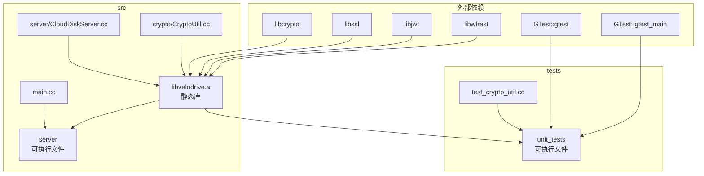

# VeloDrive CMake 构建系统说明

## 目录

- [1. 整体架构](#1-整体架构)
- [2. 顶层 CMakeLists.txt](#2-顶层-cmakeliststxt)
- [3. src/CMakeLists.txt](#3-srccmakeliststxt)
- [4. tests/CMakeLists.txt](#4-testscmakeliststxt)
- [5. 编译产物](#5-编译产物)
- [6. 依赖关系图](#6-依赖关系图)
- [7. 常用命令](#7-常用命令)
- [8. 新增模块指南](#8-新增模块指南)
- [9. 故障排查](#9-故障排查)

---

## 1. 整体架构

```
CMakeLists.txt                 ← 顶层：项目全局配置 + 子目录调度
├── src/CMakeLists.txt         ← 生产代码：静态库 + 可执行文件
└── tests/CMakeLists.txt       ← 单元测试：测试可执行文件（可选）
```

构建流程：

```
cmake ..
  │
  ├─[1] 顶层 CMakeLists.txt 执行
  │     设置 C++17、编译选项、输出路径
  │     调用 add_subdirectory(src)
  │     调用 add_subdirectory(tests) [BUILD_TESTS=ON 时]
  │
  ├─[2] src/CMakeLists.txt 执行
  │     构建 libvelodrive.a (静态库)
  │     构建 server (可执行文件)
  │
  └─[3] tests/CMakeLists.txt 执行
        构建 unit_tests (可执行文件)
        注册到 CTest
```

---

## 2. 顶层 CMakeLists.txt

### 文件位置

`/CMakeLists.txt`（项目根目录）

### 逐段解析

```cmake
cmake_minimum_required(VERSION 3.15)
project(CloudDisk)
```

- `cmake_minimum_required`：声明最低 CMake 版本。低于 3.15 会报错并拒绝执行。
- `project(CloudDisk)`：定义项目名称。同时设置 `${PROJECT_NAME}` = `CloudDisk`、`${CMAKE_PROJECT_NAME}` = `CloudDisk`。

---

```cmake
set(CMAKE_CXX_STANDARD 17)
set(CMAKE_CXX_STANDARD_REQUIRED ON)
```

- `CMAKE_CXX_STANDARD 17`：等价于编译参数 `-std=c++17`。作用于当前 CMakeLists 及其 `add_subdirectory` 的所有子目录。
- `CMAKE_CXX_STANDARD_REQUIRED ON`：如果编译器不支持 C++17，**报错终止**而非降级。

---

```cmake
set(CMAKE_RUNTIME_OUTPUT_DIRECTORY ${CMAKE_BINARY_DIR}/bin)
```

- 所有可执行文件的输出路径。假设 `cmake ..` 在 `build/` 目录执行：
  - `${CMAKE_BINARY_DIR}` = `build/`
  - 最终输出路径 = `build/bin/`
  - `server` 可执行文件落在 `build/bin/server`
  - `unit_tests` 可执行文件落在 `build/bin/unit_tests`

> **注意**：静态库不由此变量控制，默认输出到 `build/src/libvelodrive.a`。

---

```cmake
add_compile_options(-g)
```

- 全局编译选项，等价于为所有 target 添加 `-g`。
- `-g`：生成调试信息，支持 gdb 调试。
- 与旧版 CMake 中 `target_compile_options(server PRIVATE -g)` 的区别：
  - 旧版：仅 `server` 目标有 `-g`
  - 新版：**所有** target（含 `velodrive`、`unit_tests`）都有 `-g`

---

```cmake
add_subdirectory(src)
```

- 引入 `src/CMakeLists.txt`，进入子目录执行。
- `src/` 中定义的所有 target 都可以被上层引用。

---

```cmake
option(BUILD_TESTS "Build unit tests" ON)
if(BUILD_TESTS)
    enable_testing()
    find_package(GTest REQUIRED)
    add_subdirectory(tests)
endif()
```

- `option(BUILD_TESTS ON)`：定义布尔开关，默认值 `ON`。
  - 关闭方式：`cmake .. -DBUILD_TESTS=OFF`
- `enable_testing()`：启用 CTest 测试框架。
- `find_package(GTest REQUIRED)`：查找 Google Test 库。`REQUIRED` 表示找不到则报错终止。
  - 系统需预装 gtest（如 `apt install libgtest-dev`）
- `add_subdirectory(tests)`：只在 `BUILD_TESTS=ON` 时引入测试子目录。

---

## 3. src/CMakeLists.txt

### 文件位置

`/src/CMakeLists.txt`

### 逐段解析

```cmake
add_library(velodrive STATIC
    server/CloudDiskServer.cc
    crypto/CryptoUtil.cc
)
```

- 构建**静态库** `libvelodrive.a`。
- `STATIC`：明确指定为静态库（`.a`），非动态库（`.so`）。
- 源文件路径相对于当前 `CMakeLists.txt`（即 `src/` 目录）。
- `velodrive` 是这个 target 的逻辑名称，后续用 `target_link_libraries(... velodrive ...)` 引用。

> **扩展时**：新增业务 `.cc` 文件在此追加即可。

---

```cmake
target_include_directories(velodrive PUBLIC
    ${CMAKE_SOURCE_DIR}/include
)
```

- 为 `velodrive` 添加头文件搜索路径。
- `PUBLIC`：传播属性。含义如下：

| 关键字 | 效果 |
|--------|------|
| `PRIVATE` | 仅编译 `velodrive` 本身时生效 |
| `INTERFACE` | 仅链接 `velodrive` 的 target 生效 |
| `PUBLIC` | 以上两者都生效 |

- 路径 `${CMAKE_SOURCE_DIR}/include` 即项目根目录下的 `include/`。
- 因此所有 `.cc` 文件中可以直接写 `#include "common.h"` 而非 `#include "../include/common.h"`。
- 由于是 `PUBLIC`，链接 `velodrive` 的 `server` 和 `unit_tests` 也会自动获得这个路径。

---

```cmake
target_link_libraries(velodrive PUBLIC
    crypto
    ssl
    jwt
    wfrest
)
```

- 链接外部依赖库。
- `crypto` `ssl`：OpenSSL 的加密和 SSL 库（`-lcrypto -lssl`）。
- `jwt`：libjwt，用于 JWT 令牌生成和验证。
- `wfrest`：C++ HTTP 框架（基于 workflow）。
- 同样使用 `PUBLIC` 传播，链接 `velodrive` 的 target 自动获得这些依赖。

---

```cmake
add_executable(server
    main.cc
)

target_link_libraries(server PRIVATE velodrive)
```

- `add_executable(server main.cc)`：构建可执行文件 `server`，入口为 `main.cc`。
- `target_link_libraries(server PRIVATE velodrive)`：
  - `server` 依赖 `velodrive` 静态库。
  - `PRIVATE`：`server` 不需要对外暴露 `velodrive` 的头文件（只有 `main.cc` 用）。

### 依赖链

```
server (可执行文件)
  └── velodrive (静态库)
        ├── src/server/CloudDiskServer.cc
        ├── src/crypto/CryptoUtil.cc
        └── 外部库: crypto, ssl, jwt, wfrest
```

---

## 4. tests/CMakeLists.txt

### 文件位置

`/tests/CMakeLists.txt`

### 逐段解析

```cmake
add_executable(unit_tests
    test_main.cc
    test_crypto_util.cc
)
```

- 构建测试可执行文件 `unit_tests`。
- 每个 `test_*.cc` 文件对应一个模块的单元测试。

---

```cmake
target_include_directories(unit_tests PRIVATE
    ${CMAKE_SOURCE_DIR}/include
)
```

- 测试代码也需要访问 `include/` 下的头文件。
- `PRIVATE`：仅编译测试代码时使用，不会传播。

> **为什么用 PRIVATE 而非 PUBLIC？**
>
> `unit_tests` 是最终的可执行文件，不会再有其他 target 链接它，因此无需 `PUBLIC` 传播。

---

```cmake
target_link_libraries(unit_tests PRIVATE
    velodrive
    GTest::gtest
    GTest::gtest_main
)
```

- `velodrive`：链接业务代码，可以直接测试其中的函数。
- `GTest::gtest`：Google Test 核心库。
- `GTest::gtest_main`：自动提供 `main()` 函数，无需手写测试入口。

> **注意**：`tests/CMakeLists.txt` 中列出的 `test_main.cc` 和 `GTest::gtest_main` 提供了两个 `main()`，会冲突。实际上如果使用 `GTest::gtest_main`，则不需要 `test_main.cc`。这里列出 `test_main.cc` 作为可选方案，实际使用时二选一：
> - 方案 A：删除 `test_main.cc`，由 `GTest::gtest_main` 提供 main
> - 方案 B：删除 `GTest::gtest_main`，自行在 `test_main.cc` 中写 main

---

```cmake
include(GoogleTest)
gtest_discover_tests(unit_tests)
```

- `include(GoogleTest)`：加载 CMake 的 GoogleTest 集成模块（CMake 3.9+ 内置）。
- `gtest_discover_tests(unit_tests)`：**自动发现** `unit_tests` 中的所有测试用例并注册到 CTest。
  - 不需要手动写 `add_test(...)`。
  - 执行 `ctest` 时会逐个运行测试用例，显示每个用例的通过/失败状态。

### 测试链路

```
unit_tests (可执行文件)
  ├── test_main.cc          ← 可选的测试入口
  ├── test_crypto_util.cc   ← 测试用例
  └── 链接依赖:
        ├── velodrive       ← 被测代码
        ├── GTest::gtest    ← 测试框架
        └── GTest::gtest_main ← 测试入口
```

---

## 5. 编译产物

假设执行：

```bash
mkdir build && cd build
cmake ..
make
```

产物清单：

| 产物 | 路径 | 类型 |
|------|------|------|
| `libvelodrive.a` | `build/src/libvelodrive.a` | 静态库 |
| `server` | `build/bin/server` | 可执行文件 |
| `unit_tests` | `build/bin/unit_tests` | 测试可执行文件（`BUILD_TESTS=ON` 时） |

---

## 6. 依赖关系图



---

## 7. 常用命令

### 基本构建

```bash
# 完整构建（含测试）
mkdir -p build && cd build
cmake ..
make -j$(nproc)

# 只编译不运行测试
make -j$(nproc)

# 运行所有测试
ctest

# 运行测试并显示详细输出
ctest --output-on-failure
```

### 选择性构建

```bash
# 关闭测试
cmake .. -DBUILD_TESTS=OFF
make -j$(nproc)

# 重新生成构建文件（已修改 CMakeLists 后）
cmake ..
make -j$(nproc)

# 只编译 server
make server

# 只编译单元测试
make unit_tests
```

### 清理

```bash
# 完全清理
rm -rf build/

# 重新构建
mkdir build && cd build && cmake .. && make -j$(nproc)
```

---

## 8. 新增模块指南

### 场景：新增一个模块（如第二期的 `oss/` 阿里云存储适配器）

**步骤 1**：创建文件

```
src/oss/OSSClient.h    → 或放在 include/ 平铺
src/oss/OSSClient.cc
```

**步骤 2**：修改 `src/CMakeLists.txt`

```cmake
add_library(velodrive STATIC
    server/CloudDiskServer.cc
    crypto/CryptoUtil.cc
    account/AccountHandler.cc       # 之前已有
    file/FileHandler.cc             # 之前已有
    oss/OSSClient.cc                # ← 新增这一行
)
```

**步骤 3**：如果新模块引入了新依赖（如阿里云 OSS SDK）

```cmake
target_link_libraries(velodrive PUBLIC
    crypto ssl jwt wfrest
    alibabacloud-oss-cpp-sdk        # ← 新增依赖
)
```

**步骤 4**：重新构建

```bash
cd build && cmake .. && make -j$(nproc)
```

> **无需修改**：顶层 `CMakeLists.txt`（除非需要新增外部库的 `find_package`）、`tests/CMakeLists.txt`（除非要新增测试文件）。

### 场景：新增测试文件

**步骤 1**：创建 `tests/test_oss_client.cc`

**步骤 2**：修改 `tests/CMakeLists.txt`

```cmake
add_executable(unit_tests
    test_crypto_util.cc
    test_account_handler.cc
    test_file_handler.cc
    test_oss_client.cc          # ← 新增
)
```

**步骤 3**：构建并运行

```bash
cd build && cmake .. && make unit_tests && ctest
```

`gtest_discover_tests` 会自动发现所有 `TEST()` 宏。

---

## 9. 故障排查

### 找不到 GTest

```bash
# Ubuntu / Debian
sudo apt install libgtest-dev cmake

# 或者手动编译 gtest
cd /usr/src/gtest
sudo cmake CMakeLists.txt
sudo make
sudo cp lib/*.a /usr/lib
```

如果无法安装系统级 gtest，临时关掉测试：

```bash
cmake .. -DBUILD_TESTS=OFF
```

### `#include` 找不到头文件

确保 `include/` 目录存在且头文件已放置：

```bash
ls include/
# 应看到: CloudDiskServer.h  CryptoUtil.h  common.h
```

### `undefined reference` 链接错误

通常是 `target_link_libraries` 中缺少依赖。检查以下几点：
- 外部库已安装（`crypto`、`ssl`、`jwt`、`wfrest`）
- 新增的 `.cc` 文件已加入 `velodrive` 的源文件列表
- 新增的外部依赖已加入 `target_link_libraries`

### 可执行文件找不到

新的输出路径是 `build/bin/server`，而非 `build/server`。注意 `CMAKE_RUNTIME_OUTPUT_DIRECTORY` 的设置。
